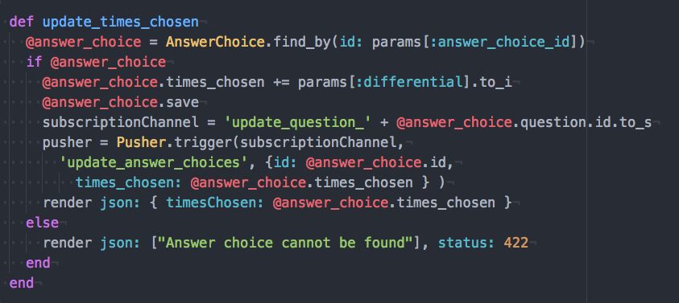
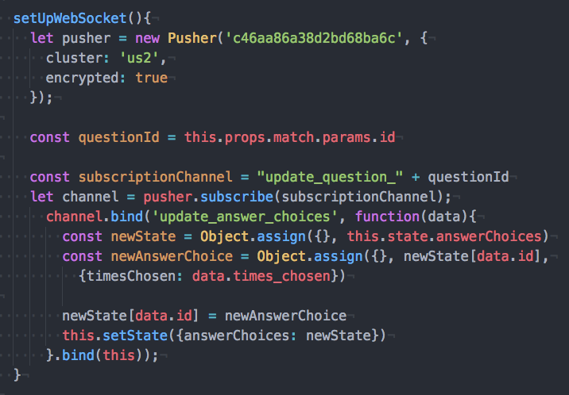

# README

## Overview
- https://poll-paradise.herokuapp.com/
- Poll-Paradise is a Ruby on Rails/React-Redux single-page clone of Poll Everywhere, a live-update poll service using Web Sockets.

## List of Features
- Create multiple-choice questions.
- Ability to group questions into descriptive groups.
- Activate and deactivate
- Ability to upload pictures as an answer choice.
- Live-update poll-view that updates as users respond.
- Poll-Response that triggers poll-view to update.
- Full-user authentication.

## Structure
  ### Backend
- Ruby on Rails with PostgreSQL.

  ### Frontend
- Single page app made with React/Redux.

## Technical Highlights
  ### WebSockets and Pusher API for live-update polling.

  Poll-Paradise uses the Pusher API, and React/Redux Router to dynamically subscribe to the appropriate web-socket.
  
  

---
