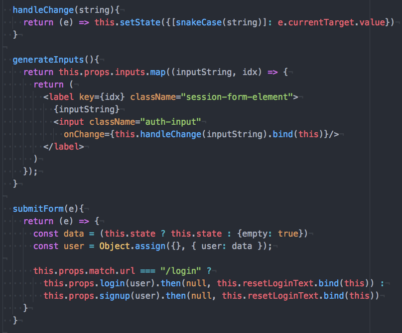
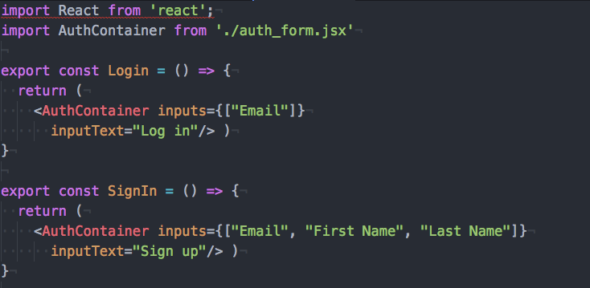
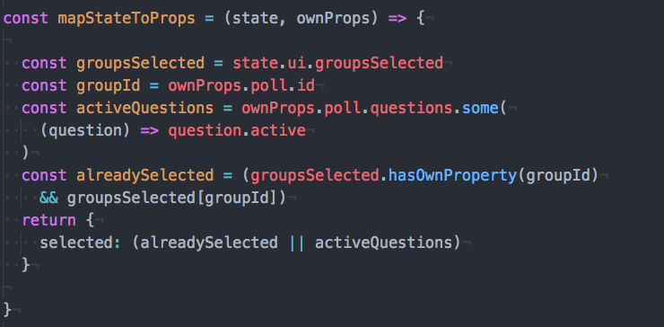
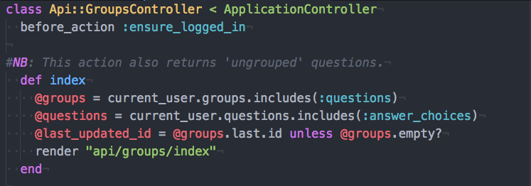

# README

## Overview
- https://poll-paradise.herokuapp.com/
- Poll-Paradise is a Ruby on Rails/React-Redux single-page clone of Poll Everywhere, a live-update poll service using Web Sockets.

## List of Features
- Live-update poll-view that updates as users respond.
- Poll-Response that triggers poll-view to update.
- Create multiple-choice questions.
- Ability to group questions into descriptive groups.
- Ability to upload pictures as an answer choice.
- Activate and deactivate questions to be taken.
- Full-user authentication.

## Structure
### Backend
- Ruby on Rails with PostgreSQL.
- Pusher for WebSockets.

### Frontend
- Single page app made with React/Redux.
- Recharts for data-visualization.

## Technical Highlights

### WebSockets and Pusher API for live-update polling

  Poll-Paradise uses the Pusher API, and React/Redux Router to dynamically subscribe to the appropriate web-socket. Implementation is scalable, as each time web-socket is triggered, the updated answer choice object is delivered to the frontend. This destroys the need to make another request to the server as responses shuffles in.

  

  /app/controllers/api/answer_choices_controller.rb
  

  /frontend/components/poll-show/poll-show-container.js
  

### Local storage to ensure integrity of data

Poll-Paradise uses local storage to ensure that any one respondent does not respond to a single poll more than once, unless their response has been cleared.

  

### Minimization of Network Requests for Scalability
Poll-Paradise has taken every opportunity to minimize the amount of times we hit our database, allowing for fast use. All of the questions and groups are fetched after our first request. After this, as questions are added, removed, and altered, we only change our normalized redux state, as is needed, eliminating costly requests.

  

### Dynamically generated login/signup page, based on React Props

By dynamically generating our inputs based on React props, we are able to keep our code DRY, allowing for us to easily delete/add-on additional member details. Through the use of Lodash's String.prototypye.snakeCase, we are able to map our Capitalized Input Text to precisely what our backend is expecting.

  
  

### Intelligent Hiding/Displaying of Polls

Using a UI slice of state, and UI actions, poll-paradise remembers which groups you have displayed and which groups you have hidden. Upon creating a group, and upon assigning questions to that group, this group is automatically opened for you. Additionally upon your first request, your active-poll and your most-recently-updated poll are both automatically opened for you.

  
  

---
